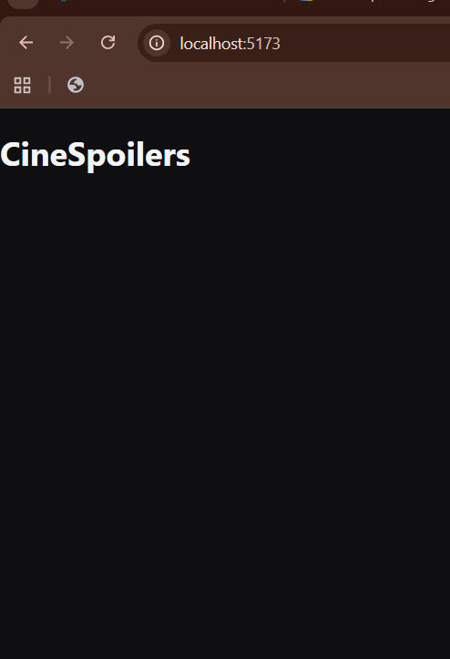
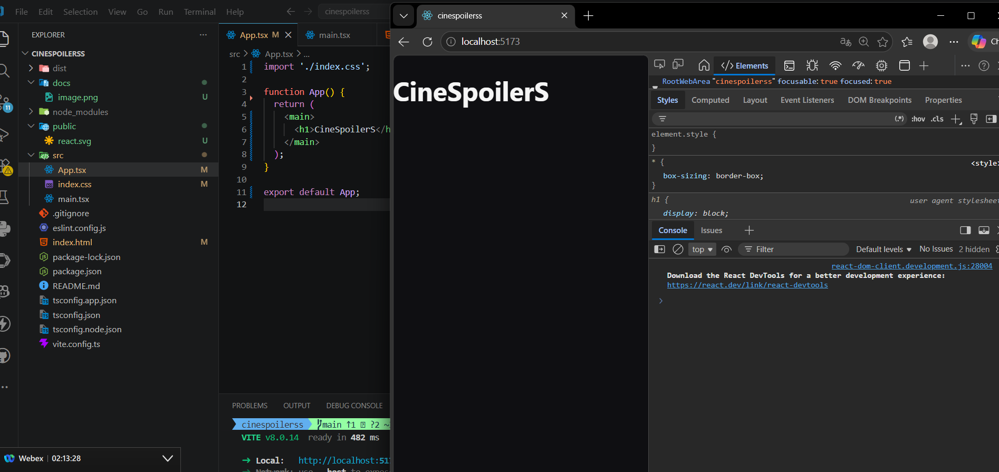
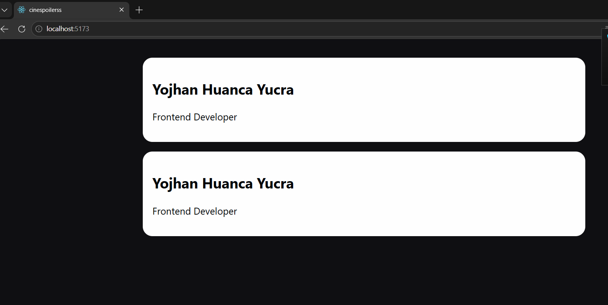
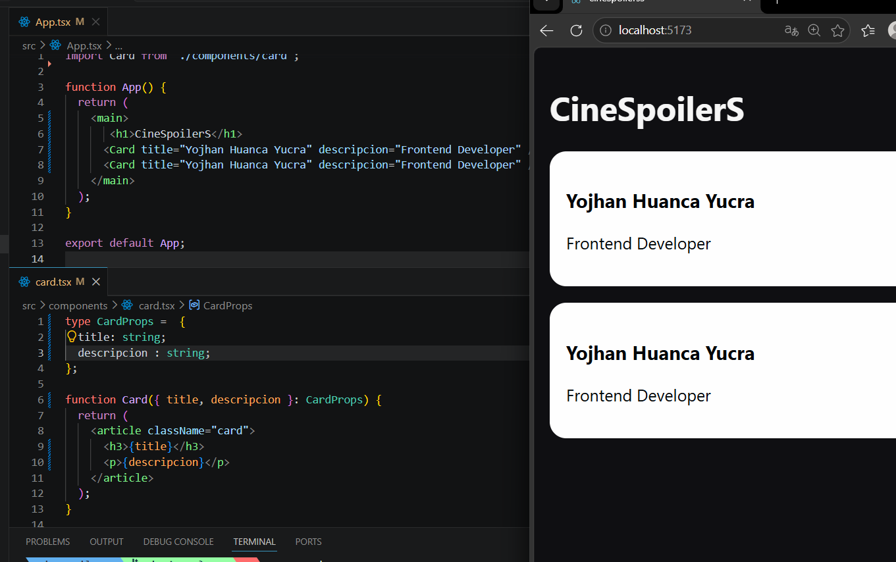
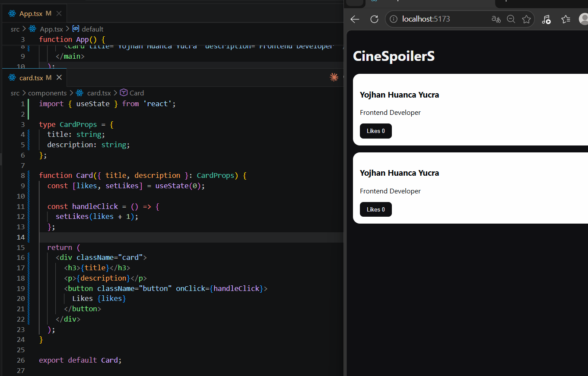

# CineSpoilerS

## Datos del estudiante

- Nombre: Yojhan Huanca Yucra
- Tema: Componentes, props y manejo de estado en React

## Evidencias

### 1. Vista inicial del proyecto

Se muestra la primera version de la aplicacion ejecutandose en `localhost:5173`.



### 2. Favicon configurado

Se agrego un icono personalizado en la pestana del navegador usando un archivo SVG en la carpeta `public`.



### 3. Componente Card

Se creo una tarjeta reutilizable para mostrar el nombre y la descripcion.



### 4. Uso de props

El componente `Card` recibe los valores `title` y `description` desde `App.tsx`.



### 5. Manejo de estado

Se agrego `useState` para controlar el contador de likes. Cada tarjeta tiene su propio estado y aumenta al presionar el boton.



## Codigo principal

### Componente Card

```tsx
import { useState } from 'react';

type CardProps = {
  title: string;
  description: string;
};

function Card({ title, description }: CardProps) {
  const [likes, setLikes] = useState(0);

  const handleClick = () => {
    setLikes(likes + 1);
  };

  return (
    <div className="card">
      <h3>{title}</h3>
      <p>{description}</p>
      <button className="button" onClick={handleClick}>
        Likes {likes}
      </button>
    </div>
  );
}

export default Card;
```

### Uso del componente

```tsx
import Card from './components/card';

function App() {
  return (
    <main>
      <h1>CineSpoilerS</h1>
      <Card title="Yojhan Huanca Yucra" description="Frontend Developer" />
      <Card title="Yojhan Huanca Yucra" description="Frontend Developer" />
    </main>
  );
}

export default App;
```

## Ejecucion del proyecto

Instalar dependencias:

```bash
npm install
```

Ejecutar en modo desarrollo:

```bash
npm run dev
```

Generar version de produccion:

```bash
npm run build
```

## Conclusion

Con este trabajo se practico la creacion de componentes en React, el uso de props para enviar informacion y el manejo de estado con `useState` para crear una interaccion dentro de la interfaz.
